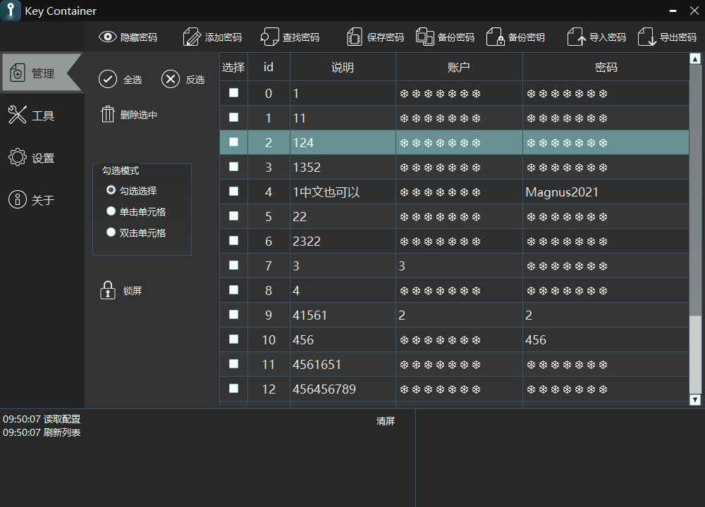
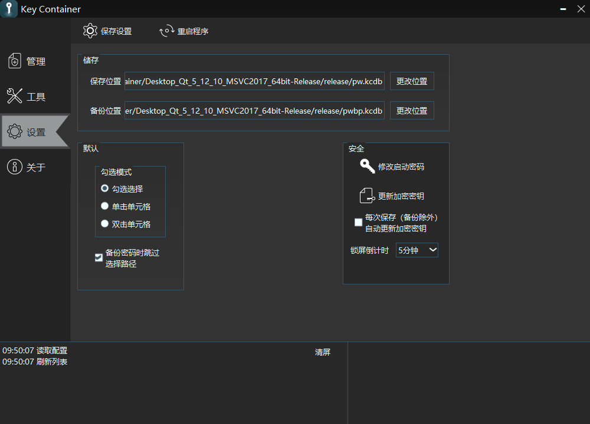

# KeyContainer
## 描述
+ 一款保存账号和密码的工具，基于Qt5.1x
+ 完全离线，不联网
+ 支持Windows及Linux，一只脚刚踏上Android
+ 支持设置密码保护记载的数据
+ 支持密码以明文及加密的形式导入和导出
+ 自测在windows(windows 10)和linux(Ubuntu、CentOS 7)下可以正常使用 
 
 

## 其他信息
+ 曾试图往移动端(Android)移植，基本功能实现了，但后来由于种种原因又鸽掉了
+ 因为有一些固定的东西写死在程序里了所以并不怎么安全。~~在改了，进度0%~~
+ 有部分代码是自己祖传的，战线拉得太长我也不记得了--
+ 如果真的要用的话**建议及时导出明文形式的备份**，因为加密后的数据说不定什么时候就读不了了
+ 写得很烂，在慢慢改
## 编译
### 环境要求
+ 要求Qt版本不低于5.10.0，但也别上Qt6
+ Windows平台需要安装windows 10 sdk
+ Linux平台需要有X11(大部分linux发行版都用的吧)
### 编译步骤
+ 使用QtCreator打开KeyContainer.pro，设置好套件(kits)后编译即可
## License
### Qt-AES
+ 对保存的账号密码数据进行AES加密的部分使用了[Qt-AES](https://github.com/bricke/Qt-AES/)的代码
### Qt-Widgets-password-dialog-with-Caps-Lock-check
+ 收键盘输入时提示“大写锁定开启”的部分的代码来自[Qt-Widgets-password-dialog-with-Caps-Lock-check](https://github.com/savolai/Qt-Widgets-password-dialog-with-Caps-Lock-check/)
## Changelog
### v3.1.9(2021.10.23)
+ 更换图标
+ 细节问题修复
### v3.1.8(2021.10.23)
+ 修复修改密码时总会提示旧密码不正确的问题
### v3.1.7(2021.10.22)
+ 修复linux平台导入数据失败的问题
+ 修复linux平台大写锁定提示不正确消失的问题
+ 修复linux退出时崩溃的问题
+ 修复处在登录界面时任务栏图标消失的问题
+ 修复重启时偶现的错误提示程序已启动的问题
### ……
